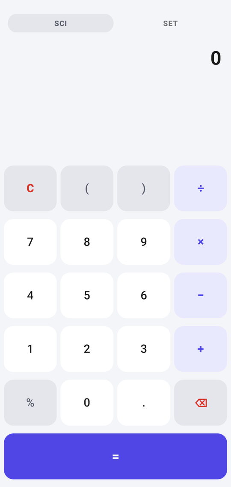
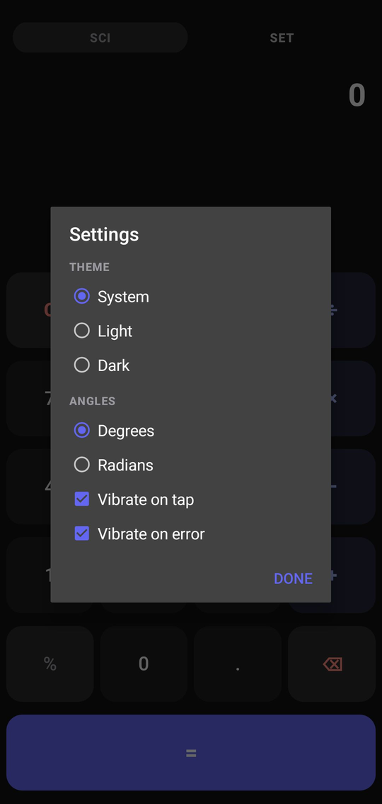
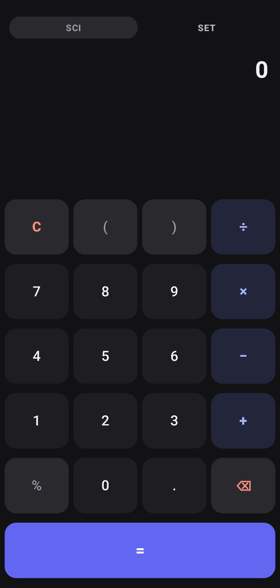

# MiniCalc

> A tiny, fast Android calculator. No ads. No accounts. No internet — just math.

[](https://github.com/sinanalizz123-max/MiniCalc/actions) [](https://github.com/sinanalizz123-max/MiniCalc/releases) [](https://github.com/sinanalizz123-max/MiniCalc/releases) [](app/build.gradle) [](#license)

**MiniCalc** is a deliberately small calculator built with nothing but the Android framework itself. No Kotlin stdlib, no AndroidX, no Material library — that is why the entire app is ~110 KB while most calculators are 5–30 MB.

### Download

**[⬇ Latest APK — Releases](https://github.com/sinanalizz123-max/MiniCalc/releases)** → install `app-release.apk`

On first install Android will ask you to allow *Install unknown apps* for your browser — allow it once.

---

## Features

- **Live preview** — answer updates as you type
- **Scientific panel** — `sin` `cos` `tan` `asin` `acos` `atan` `√` `∛` `xʸ` `!` `ln` `log` `π` `e` and parentheses; toggle with **SCI**
- **Degrees / Radians** — in **Settings → ANGLES**, persisted across restarts (default: Degrees)
- **History** — last 60 calculations, tap any entry to reuse it, with **CLEAR**
- **Adaptive keys** — labels auto-shrink and gaps tighten in split-screen / small screens so nothing gets cut off, even with SCI open
- **Theme** — System / Light / Dark (true dark `#121214`)
- **Haptics** — tap and error vibration, each toggleable in Settings
- **Offline & private** — `VIBRATE` is the only permission; no network, no tracking, no ads

## Why so small?

| App | APK size | Libraries |
| --- | --- | --- |
| Typical calculator | 5–30 MB | Kotlin + AndroidX + Material + … |
| **MiniCalc** | **~110 KB** | **None — Android framework only** |

Zero dependencies, `minifyEnabled` + `shrinkResources`, and density-specific `mipmap` icons. The whole UI is built programmatically in one file (`MainActivity.java`) — no XML layouts.

## Screenshots

<table>
<tr>
<td align="center"><br><sub>Light</sub></td>
<td align="center"><br><sub>Dark</sub></td>
<td align="center"><br><sub>Dark — SCI panel</sub></td>
</tr>
</table>

## Build

### Automatic (CI)

Every push to `main` builds a signed release APK on GitHub Actions:

`.github/workflows/build.yml` → `gradle assembleRelease` → artifact + GitHub Release (`v<run_number>`)

No local setup needed.

### Local — Termux Studio (on-device)

Termux Studio provides the native `aarch64` `aapt2` that Gradle needs on this device.

```bash
studio build ~/MiniCalc :app:assembleRelease
# → app/build/outputs/apk/release/MiniCalc_1.1.apk  (signed with debug keystore)
```

Toolchain: AGP 8.5.2 · Gradle 9.7.1 · compileSdk / targetSdk 34 · minSdk 23 · JDK 17

## Project structure

```
MiniCalc/
├── app/src/main/java/com/alisinan/minicalc/
│   ├── MainActivity.java   # entire UI (programmatic), FitTextView + adaptive gaps
│   └── MathEvaluator.java  # parser, eval, formatResult — do not rewrite casually
├── app/src/main/res/
│   ├── mipmap-*/ic_launcher.png   # density-specific launcher icons
│   ├── drawable-nodpi/ic_launcher.png
│   └── values/styles.xml   # framework themes only (Theme.Material.*)
├── app/build.gradle        # empty dependencies {} on purpose
└── .github/workflows/build.yml
```

## Tech notes

- `styles.xml` must stay on framework parents (`@android:style/Theme.Material.*`). `Theme.Material3.*` / `Theme.AppCompat.*` require libraries that were removed — referencing them breaks resource linking.
- `app/build.gradle:dependencies {}` is intentionally empty.
- Launcher icon: same art, cropped close to the edge (~98% fill) with `mipmap` per density; manifest uses `@mipmap/ic_launcher` + `roundIcon`.
- `android:screenOrientation` is not locked so split-screen / multi-window resizes correctly.

## Changelog

- **1.1 (2026-09-16)** — Pure-framework rewrite, FitTextView + adaptive gaps, ANGLES in Settings, full-bleed mipmap icons, CI releases. APK ~110 KB.

## License

[MIT](LICENSE) — do what you want, keep the notice.
